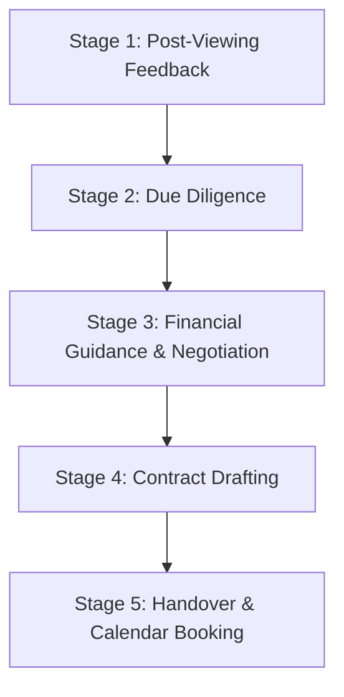

# Sierra Closer Agent (Stage-9 Closer Bot)

## Overview

The Sierra Closer Agent is the dedicated closing and negotiation intelligence module for Sierra Estates. Triggered when high-priority buyer or investor leads complete a viewing or request transaction terms, it manages post-viewing follow-ups, price correction negotiations with direct owners, contract terms, and Google Calendar handover coordination.

## 5-Stage Closing Pipeline

### Stage 1: Post-Viewing Feedback (Golden Qualification)
- **Trigger**: Viewing completion logged in Supabase `viewings` table or WhatsApp confirmation.
- **Bot Action**: Captures reaction to layout, location, pricing, and move-in timeline.
- **Script Example (Arabic)**:
  > "أهلاً بك يا فندم. نأمل أن تكون معاينة الوحدة قد نالت إعجابكم. بناءً على جولة اليوم، هل ترون أن المساحة والتقسيم الداخلي يلبيان متطلباتكم بالكامل، أم تفضلون استعراض بديل مباشر بنفس الكمبوند؟"

### Stage 2: Due Diligence Verification
- **Trigger**: Client expresses serious intent to purchase or lease.
- **Verification Routine**:
  - Title deed validation and owner identity confirmation.
  - Verification against property aggregator codes to ensure zero active duplicate/expired broker listings.
  - Verification of outstanding maintenance, service fees, and developer transfer fees.

### Stage 3: Financial Guidance & Price Correction
- **Trigger**: Negotiation initiated or asset identified as priced above trailing market comps.
- **Valuation Metric**: Evaluates listed price/sqm against the trailing compound average via `calculate_valuation_score`:
  - **Good Deal ($> 10\%$ below comps)**: Fast-track closing.
  - **Fair Value ($\pm 10\%$)**: Standard payment terms negotiation.
  - **Overpriced ($> 10\%$ above comps)**: Automated price alignment proposal to owner.
- **Arabic Negotiation Prompt**:
  > "تحياتنا يا فندم. قمنا بمراجعة بيانات السوق لـ [الكمبوند]. متوسط سعر المتر التنفيذي للوحدات المماثلة يسجل [السعر العادل] ج.م. لدينا مشتري جاد ومستعد للتعاقد الفوري في حال إمكانية تقريب السعر إلى [السعر المقترح]..."

### Stage 4: Contract Terms & Schedule Generation
- **Drafting Checklist**:
  - Deposit amount and escrow holding agreement.
  - Payment schedule (Cash milestone or installment structure).
  - Furniture/appliance condition inventory (if furnished).
  - Expected handover date and penalty clauses.

### Stage 5: Closing Handover & Calendar Coordination
- **Trigger**: Agreement reached between buyer and owner.
- **Action**:
  - Books closing signing meeting via Google Calendar API.
  - Pushes deal stage update to CRM pipeline (`closed_won`).
  - Sends automated WhatsApp reminder 24 hours prior to appointment.

## Integration Reference

- **Vault Knowledge**: [`docs/obsidian-vault/sierra_blue_closer_agent_workflow.md`](file:///h:/last/Main/SE-Vercel-deploy-main/docs/obsidian-vault/sierra_blue_closer_agent_workflow.md)
- **Database Tables**: `listings`, `viewings`, `leads`
- **Memory Palace Room**: `negotiations` room via `mempalace`
