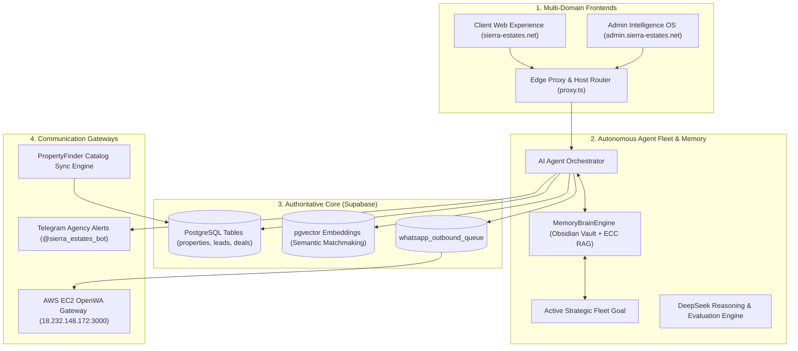

# Sierra Estates Realty — Enterprise AI PropTech Platform

[](https://nextjs.org/)
[](https://turbo.build/)
[](https://www.typescriptlang.org/)
[](https://supabase.com/)
[-brightgreen)](https://github.com/sierrablue8866-droid/SE-Vercel-deploy-main)
[](https://sierra-estates.net)
[](https://sierra-estates.net)
[](#license--maintainers)

> **Sierra Estates Realty** is the premier enterprise luxury PropTech intelligence platform engineered for the Egyptian luxury property market (New Cairo / Fifth Settlement). It unites client property discovery, algorithmic valuation, automated WhatsApp & Telegram lead concierges, interactive spatial masterplan maps, and an autonomous multi-agent fleet grounded by a unified **Obsidian + ECC Memory Brain Engine**.

---

## 🏛️ System Architecture

The platform operates as a high-performance **Turborepo** monorepo featuring a dual-domain Next.js 16 deployment backed by Supabase PostgreSQL:

- **Client Web Portal ([`https://sierra-estates.net`](https://sierra-estates.net)):** High-polish luxury buyer experience featuring deep obsidian glassmorphism, high-contrast Plus Jakarta Sans typography, interactive Leaflet spatial masterplan map with GPS polygon boundaries, 3D virtual tours, real-time ROI/installment calculators, AI investment teasers, multilingual search (Arabic/English), and Easy Listing intake.
- **Admin Intelligence OS ([`https://admin.sierra-estates.net`](https://admin.sierra-estates.net)):** Full-featured operational command deck with RBAC session guards, live master inventory governance (9,534+ verified units), owner negotiation tracking, CRM pipelines, agent hubs, and automated WhatsApp outreach queues.



---

## ⚡ Core Platform Pillars

### 1. High-End Luxury UI & Contrast Typography

- **Header Navigation:** Deep obsidian glassmorphism (`rgba(6, 17, 34, 0.90)` with `backdrop-filter: blur(20px)`). All menu navigation links render in **luminous high-contrast text (`rgba(255, 255, 255, 0.88)`)** using **Plus Jakarta Sans**, with glowing cyan/gold active pills.
- **Hero Search & Filter Card:** Refined obsidian glass container (`rgba(11, 23, 42, 0.82)`) with high-contrast ice-blue labels (`#93c5fd`, 800-weight), custom dark glass select dropdowns with sleek SVG chevrons, and elevated Search + Listing Net action buttons.
- **Admin Dashboard Typography:** Unified **Plus Jakarta Sans / Inter** typography stack across all admin metrics, tables, headers, and form inputs, with full bilingual **Cairo** support for Arabic.

### 2. Unified Memory Brain Engine (`@sierra-estates/memory-engine`)

Fuses the **Obsidian Knowledge Vault** (`docs/obsidian-vault/`) and the **Episodic Context Cache (ECC)** into a shared RAG service. It scans domain markdown notes (compound guides, financial cap rates) and synchronizes with real-time entity profiles, historical price reductions, and distressed deal alerts to guide all fleet agents toward a shared strategic goal.

### 3. Spatial Intelligence Masterplan Engine

Interactive Leaflet map featuring precision GPS bounding polygons and subfeatures (Crystal Lagoons, Green Spines, Clubhouses, Championship Golf Courses) across all top New Cairo masterplans (Hyde Park, Mountain View iCity, Mivida, Palm Hills, Katameya Heights, etc.).

### 4. Automated WhatsApp Concierge & Owner Outreach

Hosted on a dedicated AWS EC2 instance (`18.232.148.172:3000`) with dual pairing options (Live QR scan portal + 8-character phone pairing code). Strictly enforces the 12:00 PM – 8:00 PM Africa/Cairo operational window with a 40 contact/hour rate limit, zero-drift alignment, and strict masking of private owner phone numbers (falling back to agency helpline `+201092048333`).

### 5. Easy Listing Ingestion (`/list-property`)

Direct intake portal with client-side photo previews, auto-calculated AI valuation and urgency scoring, instant Supabase storage, real-time Telegram alerts to agency staff, and automated WhatsApp confirmation queueing.

---

## 📦 Monorepo Workspace Topology

```text
├── apps/
│   ├── sierra-estates-realty/     # Next.js 16 Full-Stack Dual-Domain Application (105 Routes)
│   ├── agents/                    # WhatsApp bot router & agent routing services
│   └── automations/               # Scheduled workers, WhatsApp scraper & unit adder
├── packages/
│   ├── memory-engine/             # Unified Obsidian + ECC MemoryBrainEngine RAG
│   ├── db/                        # Authoritative Supabase client & schemas
│   ├── agents/                    # Multi-agent systems (Matchmaker, Closer, Scribe)
│   ├── agents-core/               # Agent lifecycle, Telegram dispatcher & queue helpers
│   ├── agents-tools/              # EpisodicContextCache & schema validators
│   ├── ai-orchestrator/           # Gemini & DeepSeek LLM gateway
│   ├── deepseek-harness/          # 10-scenario AI reasoning benchmark harness
│   ├── exchange/                  # Gold parity & FX valuation arbitrage calculator
│   ├── property-finder-api/       # PropertyFinder enterprise connector
│   └── ui/                        # Reusable luxury UI components
├── docs/
│   ├── MASTER_PROJECT_PLAN.md     # Single authoritative master project plan
│   ├── obsidian-vault/            # Obsidian domain knowledge notes
│   ├── checkpoints/               # Historical release checkpoints
│   └── archive/                   # Historical reports & legacy migration guides
└── scripts/                       # Deployment gates, health probes & verification suites
```

---

## 🧪 Comprehensive Verification Status

All static, integration, security, and live production tests pass at **100%**:

```bash
# 1. Run deploy pre-flight verification gate (9/9 stages passed)
pnpm deploy:check

# 2. Run live smoke test against local or production server (6/6 HTTP 200 probes passed)
pnpm smoke:test

# 3. Run live production deployment test suite (11/11 assertions passed)
pnpm test:prod

# 4. Run client application test suite (95 suites / 1,052 tests passed)
pnpm --filter sierra-estates-client-page test

# 5. Run monorepo Vitest suite (57 files / 540 tests passed)
pnpm vitest run

# 6. Run AI reasoning benchmark harness (10/10 scenarios passed)
pnpm run-harness

# 7. Run Model Context Protocol smoke test (19/19 assertions passed)
pnpm mcp:smoke-test

# 8. Run daily executive intelligence briefing & valuation report
pnpm briefing:daily
```

| Verification Layer | Metric | Result |
|---|---|---|
| **Deploy Pre-Flight** | `pnpm deploy:check` | **9/9 Stages Passed (100%)** |
| **Next.js Production Build** | `next build --webpack` | **105/105 Pages Compiled (0 Errors)** |
| **Client Test Suite (Jest)** | Unit & Integration | **95/95 Suites, 1,052/1,052 Tests (100%)** |
| **Monorepo Vitest Suite** | Memory & Workers | **57/57 Files, 540/540 Tests (100%)** |
| **Live Production Verification** | `pnpm test:prod` | **11/11 Assertions Passed (100%)** |
| **AI Reasoning Harness** | Benchmark Evaluation | **10/10 Scenarios (100% Score)** |
| **MCP Protocol Bridge** | OAuth 2.1 & Tools | **19/19 Assertions Passed (100%)** |
| **Owner Outreach Pipeline** | E2E OpenWA Gateway | **7/7 Steps Passed (100%)** |
| **Live Smoke Probes** | Endpoints HTTP 200 | **6/6 Probes Verified (100%)** |
| **Live Active Catalog** | Supabase Postgres | **9,534 Active Units (17.78B EGP Portfolio)** |
| **Working Tree Drift** | Git Status | **Clean (0 Drift)** |

---

## 🚀 Getting Started

### Prerequisites

- **Node.js**: `>=20.0.0` (Recommended: `v22` or `v24`)
- **pnpm**: `pnpm@9.15.4` (via `corepack.cmd pnpm` or `pnpm`)

### Setup & Run

```bash
# 1. Clone repository (The One and Only Authoritative Repository)
git clone https://github.com/sierrablue8866-droid/SE-Vercel-deploy-main.git
cd SE-Vercel-deploy-main

# 2. Install workspace dependencies
pnpm install

# 3. Set up environment variables
cp .env.example .env.local

# 4. Start local development server
pnpm dev:web
```

The client portal will be available at `http://localhost:3000`.

---

## 📖 Master Roadmap & Milestones

The project follows the MCD (Mission-Contract-Delivery) alignment protocol. All 12 project milestones have been **100% completed, verified, and delivered into production**:

- **M1–M4**: Architectural Foundation, Master Inventory Engine, Spatial Compound Polygons & Dual-Domain Routing.
- **M5–M8**: Stage-9 Multi-Party AI Negotiation Engine, Institutional Wealth Forecaster, Luxury Tear-Sheet Generator, Contract & Escrow Generation.
- **M9–M10**: OpenWA WhatsApp Concierge Gateway, Telegram Alert Dispatchers, PropertyFinder Sync.
- **M11**: CI-gated deployment, admin auth normalization, worker orchestration reliability, and ECC Memory Brain Engine.
- **M12**: Realtime Egyptian-Arabic Audio Briefings, Video Property Tour Generators, Self-Healing Telemetry, and Full Production Deployment.

Authoritative documentation:
👉 **[Master Project Plan (`docs/MASTER_PROJECT_PLAN.md`)](docs/MASTER_PROJECT_PLAN.md)**

---

<a id="license--maintainers"></a>

## 📄 License & Maintainers

- **Lead Engineer:** Ahmed Fawzy ([a.fawzy8866@gmail.com](mailto:a.fawzy8866@gmail.com))
- **Organization:** Sierra Estates Realty
- **Authoritative Repository:** [https://github.com/sierrablue8866-droid/SE-Vercel-deploy-main](https://github.com/sierrablue8866-droid/SE-Vercel-deploy-main)
- **Proprietary & Confidential:** All rights reserved.
