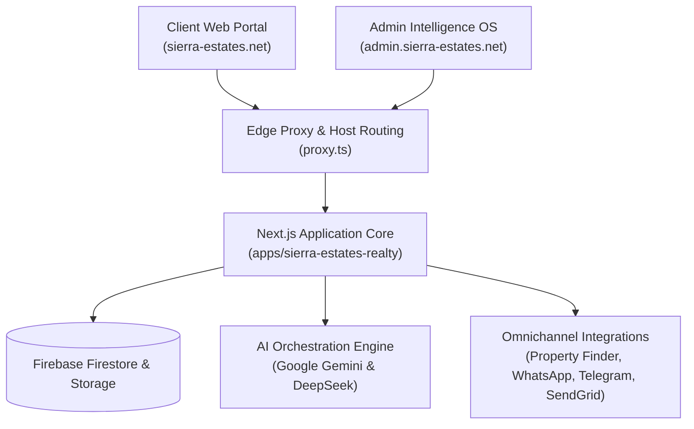

# Sierra Estates Realty — Enterprise AI Real Estate Platform

[](https://nextjs.org/)
[](https://turbo.build/)
[](https://www.typescriptlang.org/)
[](https://firebase.google.com/)
[](https://vercel.com/)
[](#)

> **Sierra Estates Realty** is an enterprise-grade, omnichannel real estate intelligence and transaction platform engineered for the luxury Egyptian property market. It unifies client discovery, administrative asset governance, algorithmic valuation, automated WhatsApp/Telegram lead concierges, and multi-agent AI orchestration.

---

## 🏛️ Architecture Overview

The system is organized as a high-performance **Turborepo** monorepo featuring a dual-domain Next.js deployment:

- **Client Portal (`https://sierra-estates.net`):** Premium buyer experience featuring 3D virtual tours, real-time ROI/installment calculators, AI investment teasers, multilingual search (Arabic/English), and automated inquiry routing.
- **Admin Intelligence OS (`https://admin.sierra-estates.net`):** Full-featured command deck with RBAC session security, live inventory management, owner negotiation tracking, CRM pipelines, agent intelligence hubs, and automated cron ingestors.



---

## 📦 Workspace Package Structure

```
├── apps/
│   └── sierra-estates-realty/     # Next.js 16 Full-Stack Dual-Domain Application
├── packages/
│   ├── admin-data/                # Admin data transformers and analytics mappers
│   ├── agents/                    # Multi-agent systems & reasoning modules
│   ├── agents-core/               # Base abstractions for autonomous agent lifecycle
│   ├── agents-tools/              # Agent tool integrations and schema validators
│   ├── ai-agent-sdk/              # Antigravity & AI Agent SDK wrappers
│   ├── ai-orchestrator/           # LLM gateway for Gemini & DeepSeek
│   ├── automations/               # Scheduled workflows & background processors
│   ├── db/                        # Firestore database access layer & schema definitions
│   ├── deepseek-harness/          # DeepSeek model evaluation and fine-tuning harness
│   ├── exchange/                  # FX rate engine & gold pricing arbitrage calculator
│   ├── memory-engine/             # Episodic Context Cache (ECC) & shared memory bus
│   ├── property-finder-api/       # Property Finder Enterprise API connector & parser
│   └── ui/                        # Reusable luxury UI design system components
├── workflows/                     # Automated data synchronization pipelines
│   ├── 01-whatsapp-scraper/       # WhatsApp group chat ingestion & listing parser
│   ├── 02-owner-search/           # Direct owner property scraper (PF/OLX)
│   ├── 03-owner-contact/          # Automated WhatsApp outreach dispatcher
│   ├── 04-email-sender/           # SendGrid targeted campaign engine
│   └── 05-unit-adder/             # Inventory sync from Google Sheets to Firestore
└── scripts/                       # Deployment, secrets, and environment tooling
```

---

## ⚡ Key Features

- **🛡️ Secure Host Routing & RBAC Gate:** Built-in middleware (`proxy.ts`) separates public buyer routes from authenticated `/admin/*` operations backed by signed HMAC session cookies and Firebase Auth.
- **🤖 Autonomous AI Concierge:** Real-time conversational agent capable of qualifying leads, calculating compound yields, scheduling viewings, and generating localized investment memos.
- **📊 Real Estate Valuation & Arbitrage Engine:** Dynamic pricing scanner comparing current inventory against historical compound averages, FX swings, and inflation metrics.
- **📲 Omnichannel Lead Dispatcher:** Native webhooks and schedulers for Meta WhatsApp Cloud API and Telegram bots with automated CRM lead creation.
- **🔄 Enterprise Data Sync:** Automated bidirectional synchronization between Google Sheets, Property Finder feeds, and Firestore.

---

## 🚀 Getting Started

### Prerequisites
- **Node.js**: `v24+` or `v26+`
- **pnpm**: `v9+` or `v10+`

### Installation
```bash
# Clone repository
git clone https://github.com/sierrablue8866-droid/SE-Vercel-deploy-main.git
cd SE-Vercel-deploy-main

# Install dependencies across all packages
pnpm install
```

### Environment Configuration
Copy the example environment template:
```bash
cp .env.example .env.local
```
Or run the automated secrets provisioner if using GitHub CLI:
```bash
node scripts/setup-github-secrets.js
```

### Development Server
```bash
# Start Next.js development server
pnpm dev
```
The application will be accessible at `http://localhost:3000`.

---

## 🧪 Testing & Validation

The workspace maintains a 100% pass rate across all unit, integration, and security test suites:

```bash
# Run all test suites across the workspace (71 suites / 765+ tests)
pnpm test

# Run type check and ESLint across all 22 packages
pnpm lint

# Run production build
pnpm build
```

---

## 🌐 Deployment & CI/CD

Continuous integration and deployments are managed via **GitHub Actions** and **Vercel**:

- **`.github/workflows/deploy-vercel.yml`**: Automated zero-downtime deployment for client and admin domains with built-in P0 environment validation gates.
- **`.github/workflows/external-workflows.yml`**: Scheduled cron workflows for Property Finder scraping, WhatsApp outreach, SendGrid campaigns, and Firestore inventory sync.

---

## 📄 License & Maintainer

- **Maintainer:** Ahmed Fawzy ([a.fawzy8866@gmail.com](mailto:a.fawzy8866@gmail.com))
- **Organization:** Sierra Estates Realty
- **Proprietary & Confidential:** All rights reserved.