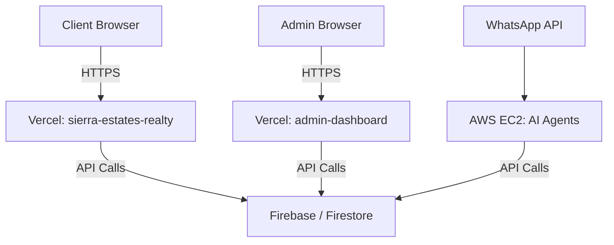

<!-- Generated: 2026-08-02 | Files scanned: ~300 | Token estimate: ~500 -->

# Sierra Estates System Architecture

## Overview
A modern web application ecosystem comprising a client portal, an admin dashboard, specialized AI agents, and a suite of backend packages in a Turborepo monorepo.

## Service Boundaries

### Apps
- `apps/sierra-estates-realty`: Client-facing Next.js application. Handles property listings, CRM integration, and customer portal.
- `apps/admin-dashboard`: Next.js SPA for internal staff. Handles property management, leads, CRM tracking, and agent routing.
- `apps/api`: Express.js or similar backend for specific API routes (containerized).

### Packages
- `@sierra-estates/admin-data`: Admin specific data access logic.
- `@sierra-estates/agents`, `agents-core`, `agents-tools`: Infrastructure for autonomous AI agents (e.g., Matchmaker, Leila).
- `@sierra-estates/api`, `api-py`, `api-zod`, `api-spec`: OpenAPI specifications, Zod schemas, and Python/Node clients.
- `@sierra-estates/db`: Database models, schemas, and abstractions.
- `@sierra-estates/memory-engine`: Vector storage and memory management for AI.
- `@sierra/property-finder-api`: Integration with Property Finder real estate CRM.
- `@sierra/whatsapp-agent`: WhatsApp integration for automated customer communication.

## Infrastructure & Data Flow
- **Hosting**: Frontend on Vercel (`sierra-estates.net` and `admin.sierra-estates.net`).
- **Backend/Compute**: AWS EC2 instance (`3.79.6.217`) for background workers, agents, and python APIs.
- **Database**: Firebase / Firestore (Document database) for primary business data.

