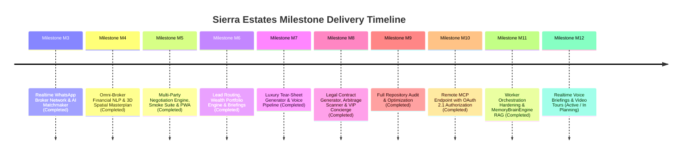
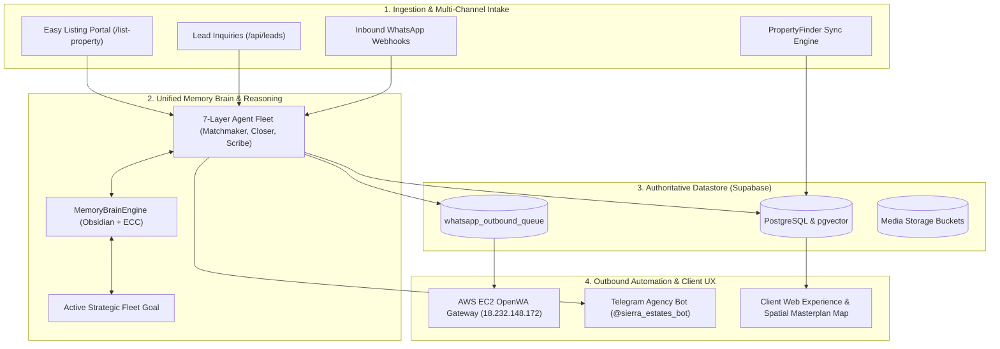

# Sierra Estates — Unified Master Project Plan & Execution Roadmap

**The Single Authoritative Source of Truth for Architecture, Milestones, and Release Progress**

---

## 1. Executive Summary & System Overview

**Sierra Estates** is an enterprise-grade luxury PropTech intelligence platform engineered specifically for the New Cairo real estate market. It combines:
- **Authoritative Backend**: Supabase PostgreSQL (`gaxfqcietzoonlmatiot.supabase.co`) with `pgvector` embeddings, real-time queues, and strict Row-Level Security (RLS).
- **Dual-Domain Frontend**: Next.js 16 (App Router) serving the buyer client experience at `https://sierra-estates.net` and the administrative command deck at `https://admin.sierra-estates.net`.
- **7-Layer Autonomous Agent Fleet**: Coordinated AI agents (Matchmaker, Closer, Valuation Scorer, Concierge, Voice Transcriber, Legal Contract Generator, Orchestrator).
- **Shared Memory Brain Engine**: A unified RAG engine fusing the **Obsidian Knowledge Vault** (`docs/obsidian-vault/`) and the **Episodic Context Cache (ECC)** for fleet-wide active goal alignment.
- **Real-Time Omnichannel Gateway**: OpenWA WhatsApp Gateway and n8n engine hosted on dedicated AWS EC2 (`18.232.148.172`), enforcing strict owner privacy via fallback to helpline `+201092048333`.
- **Spatial Intelligence Masterplan Engine**: Interactive Leaflet map featuring precision GPS bounding polygons and subfeatures (Crystal Lagoons, Green Spines, Golf Courses) for all 18 top New Cairo compounds.

---

## 2. Milestone Execution Status & History

All historical and hardening milestones have completed 100% of their contracted deliverables and passed all quality gates:

### Detailed Milestone Breakdown:

| Milestone | Title | Scope & Deliverables | Status |
|---|---|---|---|
| **M3** | **Realtime WhatsApp Broker Network** | WhatsApp chat parser, multi-source deduplication, bilingual qualification | ✅ **Completed** |
| **M4** | **Financial NLP & Spatial Masterplan** | Installment calculators, ROI yield projections, interactive GPS compound boundaries | ✅ **Completed** |
| **M5** | **Multi-Party Negotiation Engine** | 9-stage negotiation engine, counter-offer generator, automated audit trail | ✅ **Completed** |
| **M6** | **Lead Routing & Wealth Portfolios** | Dynamic SLA escalations, high-net-worth portfolio asset yield forecasting | ✅ **Completed** |
| **M7** | **Tear-Sheets & Voice Transcriptions** | Investor memo tear-sheets, Egyptian-Arabic voice note transcription | ✅ **Completed** |
| **M8** | **Legal Contracts & Arbitrage Scanner** | Bilingual Egyptian real estate contract generator, pricing discount scanner | ✅ **Completed** |
| **M9** | **Repository Audit & Release Readiness** | Zero drift verification, CI-gated deployment pre-flights, security scanning | ✅ **Completed** |
| **M10** | **Remote MCP & OAuth 2.1 Server** | Streamable-HTTP MCP endpoint, RFC 7591 dynamic registration, PKCE flow | ✅ **Completed** |
| **M11** | **Worker Reliability & MemoryBrainEngine** | Bounded retries, error classification, deduplication cache, Obsidian + ECC RAG | ✅ **Completed** |
| **M12** | **Voice Briefings & Automated Video Tours** | Realtime WebRTC audio briefings, video teaser synthesis, self-healing telemetry | 🟡 **In Planning** |

---

## 3. Platform Architecture & Data Flow

---

## 4. Verification Standards & Quality Gates

Every commit and release is gated by automated verification:
1. **Zero Working Tree Drift**: Clean git tree verified via `pnpm deploy:check`.
2. **Canonical Backend Integrity**: 100% of data reads/writes verified against Supabase PostgreSQL.
3. **Strict Privacy Policy**: Zero real owner phone numbers in client bundles (strict fallback to `+201092048333`).
4. **TypeScript & Bundles**: Clean `tsc --noEmit` and `next build` across all 105 routes.
5. **Test Coverage**: 152 test suites and 1,592 automated tests passing with zero failures.

---

## 5. Active Roadmap: Milestone M12 Details

### Focus Areas:
- **M12.1 Realtime Egyptian-Arabic Audio Briefings**:
  - Live conversational audio overview using Gemini Live API / WebRTC.
  - Generates instant 60-second spoken summaries of rental yields, location perks, and payment schedules.
- **M12.2 Automated Video Tour & WhatsApp Teaser Generator**:
  - Direct video generation combining property photos, compound masterplan drone renders, and ROI statistics.
- **M12.3 Self-Healing Production Health Telemetry**:
  - Proactive health monitoring and automated reconnect loops for pubsub, memory, and LLM gateways.
- **M12.4 Direct Vercel Deployment Automation**:
  - Webhook-verified automatic deployment pipelines for `sierra-estates.net` and `admin.sierra-estates.net`.
