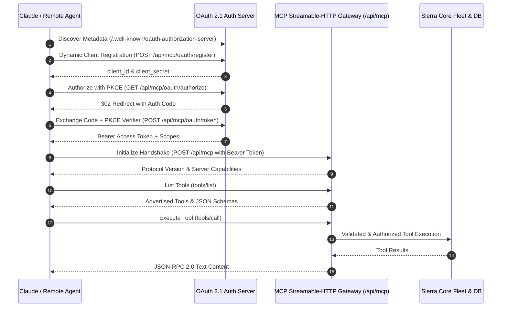

# Sierra Estates — Remote Model Context Protocol (MCP)

This document provides the authoritative specification, authorization guide, and tool reference for connecting Claude and remote agent platforms to the **Sierra Estates Remote MCP Gateway**.

---

## 1. Overview & Architecture

Sierra Estates implements a standards-compliant **streamable-HTTP / SSE remote Model Context Protocol (MCP)** server authenticated via **OAuth 2.1** with **Dynamic Client Registration (RFC 7591)** and **PKCE (Proof Key for Code Exchange)**.



---

## 2. Gateway Endpoints & Metadata

| Purpose | URL | Method | Auth Required | Specification |
| :--- | :--- | :--- | :--- | :--- |
| **Auth Server Metadata** | `/.well-known/oauth-authorization-server` | `GET` | No | RFC 8414 |
| **Protected Resource Metadata** | `/.well-known/oauth-protected-resource` | `GET` | No | RFC 9728 |
| **Dynamic Client Registration** | `/api/mcp/oauth/register` | `POST` | No | RFC 7591 |
| **Authorization Endpoint** | `/api/mcp/oauth/authorize` | `GET` | No (PKCE S256) | OAuth 2.1 / RFC 6749 |
| **Token Endpoint** | `/api/mcp/oauth/token` | `POST` | Client / PKCE | OAuth 2.1 / RFC 6749 |
| **MCP Streamable Transport** | `/api/mcp` | `GET` / `POST` / `DELETE` | Bearer Token | MCP 2024-11-05 |

---

## 3. Scope Hierarchy & Privilege Separation

Access tokens carry explicit scopes to prevent unauthorized financial operations or client messaging:

| Scope | Privilege Level | Permitted Tools |
| :--- | :--- | :--- |
| `mcp:read` | Read-only queries | `get_pipeline_summary`, `verify_payment`, `get_signature_status`, `calculate_split` |
| `mcp:tools` | Standard agent operations | Analytical tools, deal inspection, property query |
| `mcp:write` | Mutating actions & messaging | `send_message`, `send_document`, `create_pipeline_entry`, `update_pipeline_status`, `initiate_envelope`, `generate_agreement` |
| `mcp:spend` | Financial transactions | `create_payment_intent` (Stripe earnest money & commissions) |

> **Security Rule**: Read-only tokens attempting write or spend actions are strictly rejected with HTTP `403 Forbidden` and JSON-RPC error code `-32003`.

---

## 4. Connecting Claude Custom Connectors

To connect Claude to Sierra Estates:

1. **Connector URL**: Point Claude Custom Connector to:
   ```
   https://sierra-estates.net/api/mcp
   ```
2. **Zero-Config OAuth Registration**:
   Claude automatically queries `/.well-known/oauth-authorization-server`, dynamically registers via `/api/mcp/oauth/register`, performs the PKCE authorization flow, and receives an authorized Bearer token.
3. **Domain Exemption**:
   `sierra-estates.net` is a verified custom domain exempted from Vercel deployment login protection (`ssoProtection=all_except_custom_domains`), ensuring uninterrupted public API accessibility.

---

## 5. Available Tools Reference

### WhatsApp Messaging (`whatsapp-messaging`)
- `send_message`: Sends template-based notification to buyers/brokers. Requires `mcp:write`.
  - Parameters: `leadPhone` (string), `template` (string), `variables` (object, optional).
- `send_document`: Sends verified PDF proposals or contracts. Requires `mcp:write`.
  - Parameters: `leadPhone` (string), `documentUrl` (string URL).

### Sierra Strategic Deals (`sierra-strategic-pipeline`)
- `create_pipeline_entry`: Initiates transaction deal record. Requires `mcp:write`.
  - Parameters: `stakeholderId` (string), `portfolioAssetCode` (string), `terms` (object).
- `update_pipeline_status`: Transitions deal negotiation stage. Requires `mcp:write`.
  - Parameters: `pipelineId` (string), `status` (string), `stage` (string, optional).
- `get_pipeline_summary`: Inspects deal status and timeline. Allowed on `mcp:read`.
  - Parameters: `pipelineId` (string).

### Stripe Payments (`stripe-payments`)
- `create_payment_intent`: Generates deposit payment intent. Requires elevated `mcp:spend`.
  - Parameters: `amount` (number > 0), `currency` (3-char ISO code), `leadId` (string).
- `verify_payment`: Validates settlement of intent. Allowed on `mcp:read`.
  - Parameters: `intentId` (string).

### DocuSign Digital Signing (`docusign-signing`)
- `initiate_envelope`: Initiates legal digital signature envelope. Requires `mcp:write`.
  - Parameters: `documentUrl` (URL), `recipients` (array of {name, email}), `callbackUrl` (URL).
- `get_signature_status`: Checks envelope signing status. Allowed on `mcp:read`.
  - Parameters: `envelopeId` (string).

### Stage-9 Deal Closer (`stage-9-orchestration`)
- `calculate_split`: Calculates brokerage commission net yields. Allowed on `mcp:read`.
  - Parameters: `commissionTotal` (number > 0), `brokerRate` (0..1), `agentRate` (0..1).
- `generate_agreement`: Formats bilingual sales/rental agreement memo. Requires `mcp:write`.
  - Parameters: `buyerName` (string), `sellerName` (string), `priceEgp` (number > 0), `unitCode` (string).

---

## 6. Verification & Health Probe

Run the automated smoke test against production or local development:
```bash
npx tsx scripts/mcp-smoke-test.ts
```
Expected output:
```
[PASS] OAuth 2.1 Metadata Probe (/.well-known/oauth-authorization-server)
[PASS] Dynamic Client Registration (/api/mcp/oauth/register)
[PASS] PKCE Authorization Code Grant (/api/mcp/oauth/authorize & /token)
[PASS] MCP Initialize Handshake (/api/mcp)
[PASS] MCP Tool Listing (11 tools discovered with valid JSON Schema)
[PASS] Read-Only Tool Execution (get_pipeline_summary)
[PASS] Scope Protection Barrier (create_payment_intent refused on read-only token)
```
